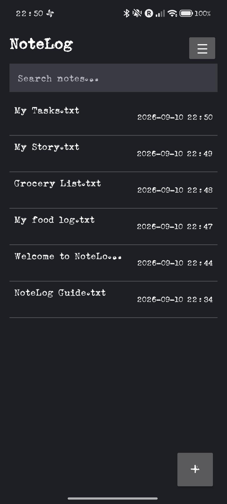
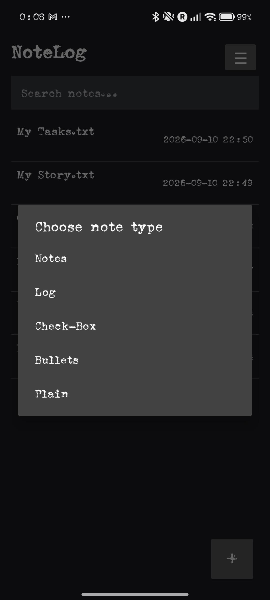
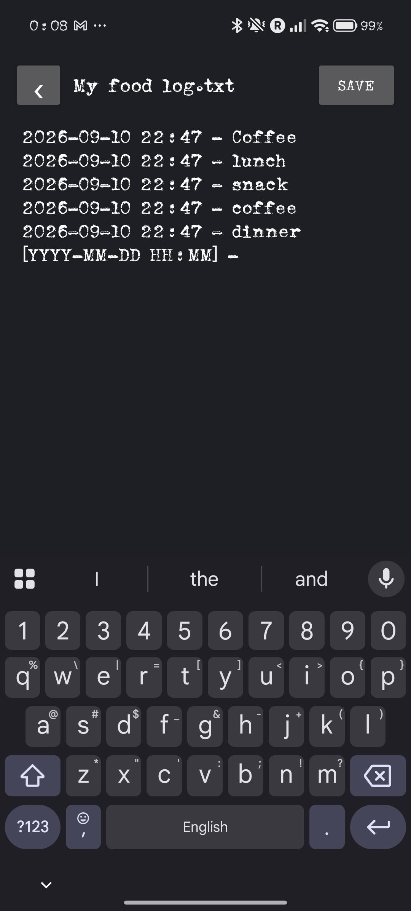
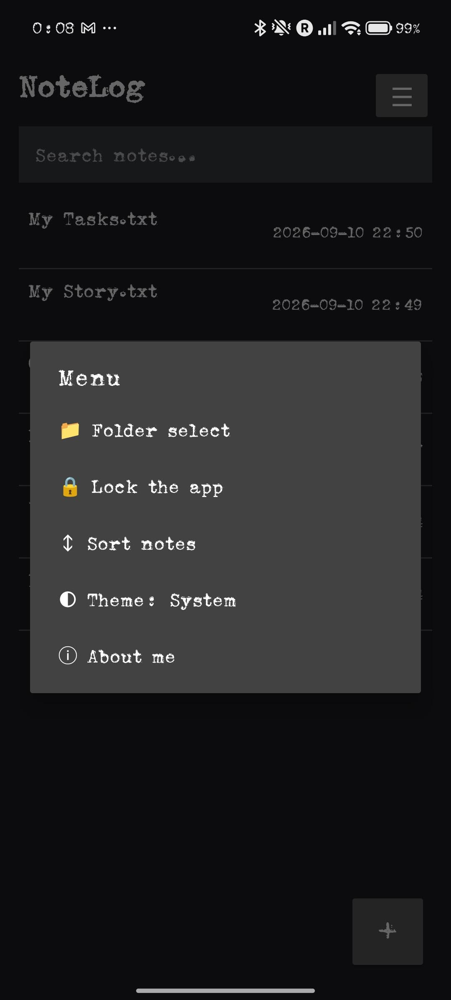

<div align="center">


# NoteLog

### Simple notes. Simple logs. Your files, your way.

A lightweight, private, local-first Android app for notes, logs, checklists, and plain-text journaling.

<p>
  <a href="https://github.com/santhoshkptm/NoteLog">
    
  </a>
  
  
  
  <a href="https://github.com/santhoshkptm/NoteLog/blob/main/LICENSE">
    
  </a>
</p>

<p>
  <a href="https://buymeacoffee.com/santhoshkptm">
    
  </a>
</p>

</div>

---

## ✨ Why NoteLog?

NoteLog is designed around one simple idea:

> **Your notes should be simple, private, portable, and yours.**

Instead of locking your writing inside a proprietary database, NoteLog stores your notes as ordinary `.txt` files in a folder you choose.

That means your notes remain easy to access, copy, back up, move, and read with other applications.

---

## 🚀 Features

<table>
<tr>
<td width="50%" valign="top">

### 📝 Flexible Note Types

- **Notes** — everyday notes with automatic bullets
- **Log** — timestamped journal entries
- **Check-Box** — simple task/check lists
- **Bullets** — quick bullet-point notes
- **Plain** — completely free-form text

</td>
<td width="50%" valign="top">

### 🔎 Powerful Basics

- Global note search
- Find text within a note
- Sort notes
- Rename notes
- Delete notes
- Autosave
- Explicit Save
- Undo / Redo
- Native copy / paste / select

</td>
</tr>

<tr>
<td valign="top">

### 🔐 Privacy & Security

- Local-first storage
- Optional app lock
- Device PIN/password/pattern support
- Biometric authentication where supported
- No cloud account required

</td>
<td valign="top">

### 🎨 Clean Experience

- Minimal Android interface
- Light and dark themes
- Simple two-column note list
- User-selected storage folder
- Notes remain ordinary `.txt` files

</td>
</tr>
</table>

---

## 🕐 Smart Log Entries

The **Log** note type makes journaling quick without forcing you to manually enter timestamps.

A new entry starts with:

```text
[YYYY-MM-DD HH:MM] -
```

Start typing and NoteLog turns it into the current timestamp:

```text
2026-09-05 12:03 - Lunch with family
```

Press **Enter** to create the next timestamp placeholder.

The timestamp remains editable, so you can correct or adjust entries whenever you need to.

---

## 📂 Your Files. Your Folder.

NoteLog uses Android's folder-selection system so you can choose where your notes live.

Your notes are stored as normal: .txt files.

This makes it possible to:

- Access your notes through Android Files
- Copy them to another device
- Back them up manually
- Open them with other text editors
- Potentially use folders provided by supported cloud-storage apps
- Keep your notes outside NoteLog's private app database

### Important

NoteLog does **not** currently provide its own cloud-sync service.

If you use a cloud-backed folder, synchronization is provided by the storage provider. Avoid editing the same note simultaneously on multiple devices because conflicts can occur.

## 📱 Screenshots

<div align="center">
  
  
  
  
</div>

## 🛠️ Project Status

NoteLog is an actively developed personal/open-source project.

The current version focuses on:

- Reliable plain-text storage
- Simple note-taking
- Timestamped logs
- Local-first operation
- Basic search and organization
- Optional security
- A clean, distraction-free interface

Some functionality may continue to evolve as the project develops.

## 🔒 Privacy Philosophy

NoteLog is built with a local-first approach.

Your notes are ordinary text files stored in a folder you choose. NoteLog does not require you to create an account or upload your notes to a NoteLog-operated cloud service.

For maximum privacy, choose a local device folder and maintain your own backups.

---

## 🤝 Contributing

Contributions, bug reports, suggestions, and improvements are welcome.

If you find an issue or have an idea:

1. Check the existing GitHub issues.
2. Open a new issue with a clear description.
3. Include steps to reproduce bugs where possible.
4. For code changes, submit a pull request with a concise explanation.

**Repository:**  
https://github.com/santhoshkptm/NoteLog

---

## ❤️ Support

If you find NoteLog useful and would like to support its development:

<div align="center">

<a href="https://buymeacoffee.com/santhoshkptm">
  
</a>

</div>

Every bit of support is appreciated.

---

## 👤 Author

**Santhosh Mankali**

- GitHub: https://github.com/santhoshkptm
- NoteLog: https://github.com/santhoshkptm/NoteLog
- Buy Me a Coffee: https://buymeacoffee.com/santhoshkptm

---

## 📜 License

NoteLog is released under the **MIT License**.

See [LICENSE](LICENSE) for details.

---

<div align="center">

**NoteLog**  
*Simple notes. Simple logs. Your files, your way.*

Made with ❤️ for people who like keeping things simple.

</div>
